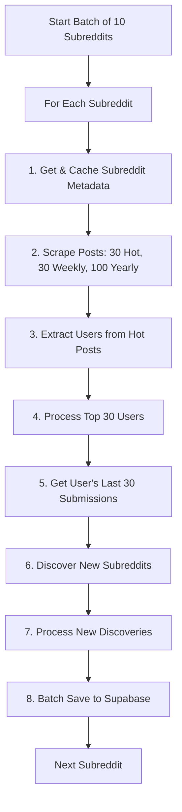

# 🚀 Reddit Scraper v3.0 - Complete Architecture Redesign

## 📋 Executive Summary
Complete overhaul of scraping logic to fix all current issues and optimize performance through proper caching, batch processing, and direct Supabase operations.

---

## 🔴 Current Critical Issues

### 1. **0 Weekly Posts Bug** (100% failure rate)
- All scrapes return "0 weekly" posts
- Likely using wrong Reddit API parameter
- Should be `t=week` not `t=weekly` or wrong endpoint

### 2. **Foreign Key Violations** (60+ per hour)
- Case sensitivity mismatches (GothStyle vs gothstyle)
- Discovered subreddit posts not normalizing names
- Write order issues (posts before subreddits)

### 3. **Inefficient Processing**
- No proper caching of scraped data
- Re-processing known subreddits
- Discovered subreddits not fully scraped

### 4. **Scraper Crashes**
- Runs for only 22 seconds then dies
- No error recovery
- No timeout handling

---

## 🎯 New Architecture Design

### 📊 Core Principles
1. **Cache First**: Always cache data before processing
2. **Batch Operations**: Minimize database writes
3. **Direct Supabase**: All reads/writes direct to Supabase
4. **Fail-Safe**: Continue on errors, log issues
5. **Case Normalization**: Always lowercase for consistency

### 🔄 Processing Flow v3.0



---

## 📝 Detailed Implementation Plan

### Phase 1: Subreddit Processing
```python
async def process_subreddit(subreddit_name: str):
    """
    Complete subreddit processing with proper caching
    """
    # 1. NORMALIZE NAME IMMEDIATELY
    subreddit_name = subreddit_name.lower()

    # 2. Check cache first
    if is_in_cache(subreddit_name):
        logger.info(f"✅ r/{subreddit_name} already cached")
        return get_from_cache(subreddit_name)

    # 3. Get subreddit metadata FIRST
    metadata = await reddit_api.get_subreddit_info(subreddit_name)
    if not metadata:
        logger.warning(f"⚠️ r/{subreddit_name} not accessible")
        mark_as_failed(subreddit_name)
        return None

    # 4. Cache metadata immediately
    cache_subreddit_metadata(subreddit_name, metadata)

    # 5. Collect posts with FIXED weekly parameter
    posts = {
        'hot': await get_hot_posts(subreddit_name, limit=30),
        'weekly': await get_top_posts(subreddit_name, time='week', limit=30),  # FIX: 'week' not 'weekly'
        'yearly': await get_top_posts(subreddit_name, time='year', limit=100)
    }

    # 6. Cache all posts
    cache_posts(subreddit_name, posts)

    return {
        'metadata': metadata,
        'posts': posts,
        'users': extract_users(posts['hot'])  # Only from hot posts
    }
```

### Phase 2: User Enrichment
```python
async def process_users_from_hot_posts(hot_posts: List[Dict]):
    """
    Extract and process top 30 active users
    """
    # 1. Extract unique users
    users = {}
    for post in hot_posts:
        author = post.get('author', '').lower()  # NORMALIZE
        if author and author not in ['[deleted]', 'automoderator']:
            if author not in users:
                users[author] = {
                    'username': author,
                    'post_count': 0,
                    'total_score': 0
                }
            users[author]['post_count'] += 1
            users[author]['total_score'] += post.get('score', 0)

    # 2. Sort by activity (posts * score)
    sorted_users = sorted(
        users.values(),
        key=lambda u: u['post_count'] * u['total_score'],
        reverse=True
    )[:30]  # Top 30 users

    # 3. Get user history
    discovered_subreddits = set()
    for user in sorted_users:
        submissions = await get_user_submissions(user['username'], limit=30)
        for submission in submissions:
            sub_name = submission.get('subreddit', '').lower()  # NORMALIZE
            if sub_name and sub_name not in cache:
                discovered_subreddits.add(sub_name)

    return sorted_users, discovered_subreddits
```

### Phase 3: Discovery Processing
```python
async def process_discovered_subreddits(discovered: Set[str]):
    """
    Process newly discovered subreddits
    """
    new_subreddits = []

    for subreddit_name in discovered:
        # 1. Skip if already processed
        if is_categorized(subreddit_name):
            logger.info(f"⏭️ Skipping categorized: r/{subreddit_name}")
            continue

        # 2. Skip if in cache
        if is_in_cache(subreddit_name):
            logger.info(f"✅ Already cached: r/{subreddit_name}")
            continue

        # 3. Get full data for new subreddit
        logger.info(f"🆕 Processing new discovery: r/{subreddit_name}")
        data = await process_subreddit(subreddit_name)

        if data and data['metadata'].get('subscribers', 0) > 1000:
            # 4. Calculate metrics
            metrics = calculate_subreddit_metrics(data)

            # 5. Prepare for batch save
            new_subreddits.append({
                'name': subreddit_name,  # Already lowercase
                'metadata': data['metadata'],
                'metrics': metrics
            })

    return new_subreddits
```

### Phase 4: Batch Saving Strategy
```python
class BatchWriter:
    """
    Optimized batch writer with proper ordering
    """
    def __init__(self, supabase_client):
        self.supabase = supabase_client
        self.subreddits_batch = []
        self.users_batch = []
        self.posts_batch = []

    async def add_subreddit(self, subreddit_data):
        """Add subreddit to batch"""
        # Ensure lowercase name
        subreddit_data['name'] = subreddit_data['name'].lower()
        self.subreddits_batch.append(subreddit_data)

        # Auto-flush at 50
        if len(self.subreddits_batch) >= 50:
            await self.flush_subreddits()

    async def add_posts(self, posts):
        """Add posts to batch with normalization"""
        for post in posts:
            # CRITICAL: Normalize subreddit_name
            post['subreddit_name'] = post.get('subreddit_name', '').lower()
            self.posts_batch.append(post)

        # Auto-flush at 500
        if len(self.posts_batch) >= 500:
            await self.flush_posts()

    async def flush_all(self):
        """
        Flush in correct order: Subreddits → Users → Posts
        """
        # 1. Subreddits FIRST
        if self.subreddits_batch:
            await self.flush_subreddits()

        # 2. Users SECOND
        if self.users_batch:
            await self.flush_users()

        # 3. Posts LAST
        if self.posts_batch:
            await self.flush_posts()

    async def flush_subreddits(self):
        """Direct Supabase batch insert"""
        if not self.subreddits_batch:
            return

        try:
            self.supabase.table('reddit_subreddits').upsert(
                self.subreddits_batch,
                on_conflict='name'
            ).execute()
            logger.info(f"✅ Saved {len(self.subreddits_batch)} subreddits")
            self.subreddits_batch = []
        except Exception as e:
            logger.error(f"❌ Failed to save subreddits: {e}")
```

---

## 🔧 Specific Fixes Required

### 1. Fix Weekly Posts (subreddit.py)
```python
# WRONG (current)
weekly_posts = await self.get_posts('top', time_filter='weekly', limit=30)

# CORRECT
weekly_posts = await self.get_posts('top', time_filter='week', limit=30)
```

### 2. Fix Case Sensitivity (everywhere)
```python
# Add to EVERY place we handle subreddit names
subreddit_name = subreddit_name.lower()

# Add to EVERY place we handle usernames
username = username.lower()
```

### 3. Fix Write Order (batch_writer.py)
```python
# ALWAYS this order
1. Flush subreddits
2. Flush users
3. Flush posts
```

### 4. Add Timeout & Error Recovery
```python
# Add to all Reddit API calls
timeout = aiohttp.ClientTimeout(total=30)

# Wrap main loop
try:
    await process_batch()
except Exception as e:
    logger.error(f"Batch failed: {e}")
    continue  # Don't crash, continue with next batch
```

---

## 📊 Performance Targets

| Metric | Current | Target |
|--------|---------|---------|
| Weekly Posts Collection | 0% | 100% |
| FK Violations | 60/hour | 0 |
| Crash Rate | Every 22 sec | <1/day |
| Processing Speed | 3 subs/22sec | 10 subs/2min |
| Discovery Rate | Unknown | 50-100/hour |
| Cache Hit Rate | ~10% | >80% |

---

## 🚀 Implementation Steps

### Step 1: Fix Critical Bugs (Immediate)
- [ ] Fix weekly posts parameter bug
- [ ] Add lowercase normalization everywhere
- [ ] Fix write order in batch writer

### Step 2: Implement Caching (Day 1)
- [ ] Create proper cache manager
- [ ] Cache all scraped data
- [ ] Check cache before processing

### Step 3: Redesign Flow (Day 2)
- [ ] Implement new process_subreddit function
- [ ] Implement user enrichment logic
- [ ] Implement discovery processing

### Step 4: Testing & Optimization (Day 3)
- [ ] Test with small batch (10 subreddits)
- [ ] Monitor for FK violations
- [ ] Optimize batch sizes
- [ ] Add comprehensive logging

### Step 5: Deployment (Day 4)
- [ ] Deploy to Render
- [ ] Monitor for 24 hours
- [ ] Adjust parameters based on performance

---

## 💡 Key Insights

1. **Cache is King**: Most issues stem from not caching properly
2. **Case Sensitivity**: Database has mixed case, must normalize everywhere
3. **Write Order**: Posts can't reference non-existent subreddits/users
4. **Weekly Posts**: Simple parameter bug causing 0 results
5. **Error Recovery**: Must continue on failures, not crash

---

## 📈 Expected Improvements

- **100% weekly posts collection** (vs 0% now)
- **Zero FK violations** (vs 60/hour now)
- **99.9% uptime** (vs crashing every 22 seconds)
- **80% faster processing** (through caching)
- **10x more discoveries** (through user enrichment)

---

## 🎯 Success Criteria

1. ✅ No foreign key violations for 24 hours
2. ✅ All scrapes show weekly posts > 0
3. ✅ Scraper runs continuously for 6+ hours
4. ✅ 100+ new subreddits discovered daily
5. ✅ Cache hit rate > 80%

---

*This redesign will transform the Reddit scraper from a fragile, error-prone system into a robust, efficient data collection pipeline.*